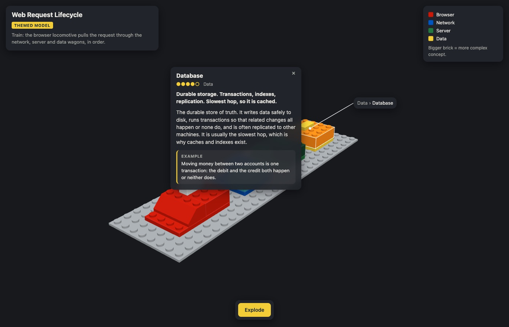
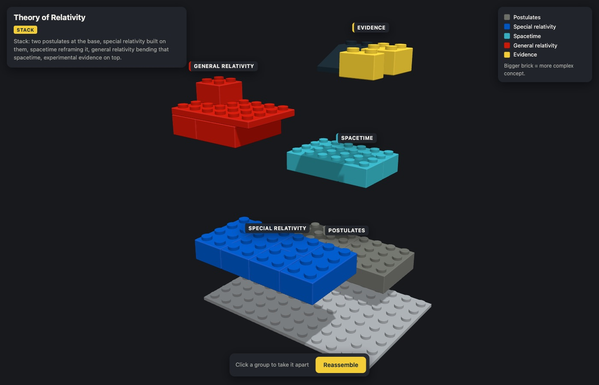
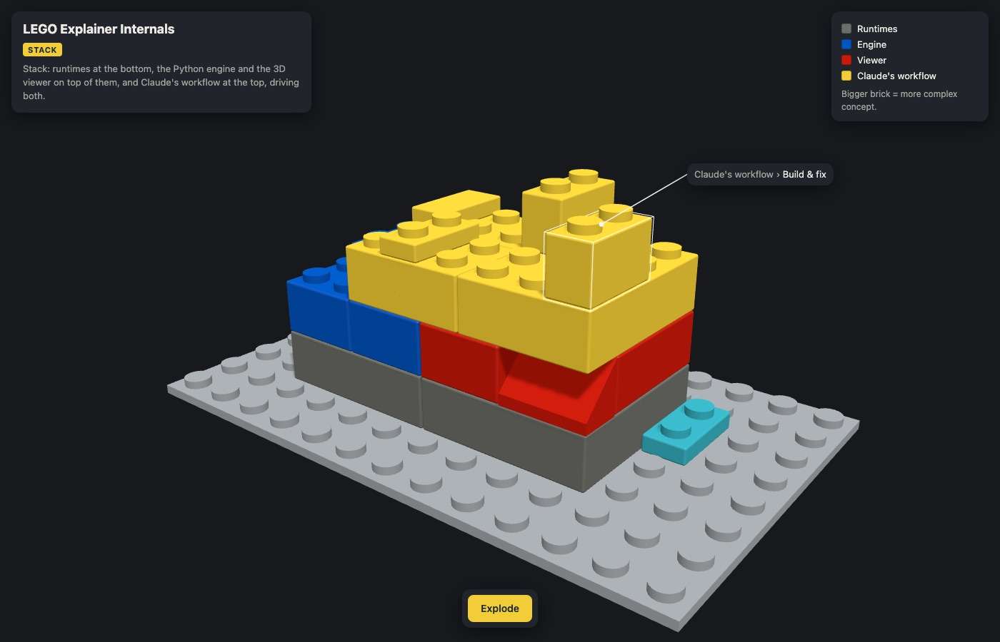
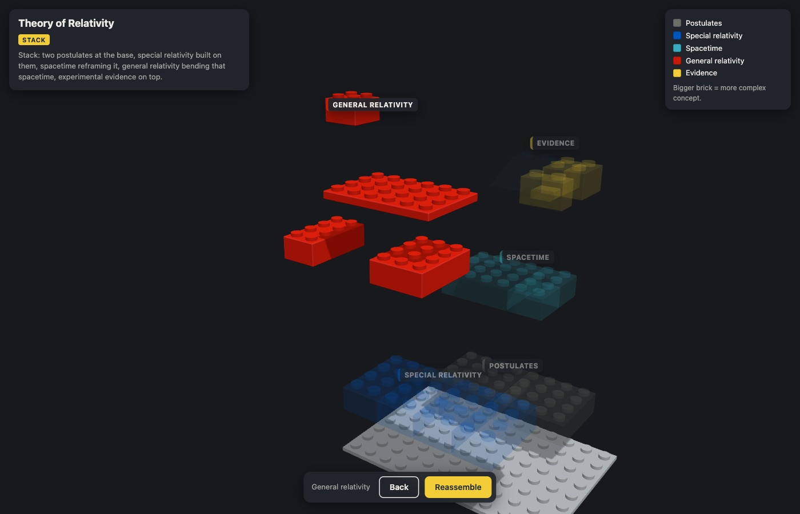

# LEGO Explainer

A [Claude Code](https://claude.com/claude-code) skill that explains a codebase, an architecture, or any complicated topic as an interactive 3D LEGO model.

Each concept is a brick, and related bricks form a sub-assembly. The finished model is the whole topic. **A brick's size shows how complex its concept is**, so you can see at a glance where the weight of the subject sits.



## What you get

One self-contained HTML page per explanation, about 40 KB, that runs in any modern browser:

| To | Do |
|---|---|
| Look at the model from any side | drag to orbit, scroll to zoom, right-drag to pan |
| Pull the sub-assemblies apart | **Explode** button or `E` |
| Take one sub-assembly apart, brick by brick | click it while exploded |
| See a brick's name | hover it: a leader line points to its title |
| Read what it is | click it: a one-line summary in bold, a fuller explanation, and a concrete example |
| Go back | `Esc`, **Back**, or **Reassemble** |

Claude chooses between two kinds of model:
- **Themed:** a real object whose parts map onto the topic, for example an HTTP request as a train (browser locomotive, network, server and data wagons). Used only when every group maps cleanly to a part of the object.
- **Stack:** layers where height means dependency. Foundations sit at the bottom and whatever depends on them sits on top.

## Examples

| | |
|---|---|
| **Web Request Lifecycle** (themed: a train)<br>[`examples/web-request.html`](examples/web-request.html) | **Theory of Relativity** (stack)<br>[`examples/relativity.html`](examples/relativity.html) |
| **LEGO Explainer Internals** (stack: this repo explaining itself)<br>[`examples/lego-explainer.html`](examples/lego-explainer.html) |  |

Download any of them and open it in a browser, or browse `examples/index.html`. The specs they were built from sit next to them as `.json` files.

| Hover a brick | Take one group apart |
|---|---|
|  |  |

## Install

Requirements: Claude Code, `python3` 3.10 or later (standard library only), and a browser with WebGL. The first time a page opens it downloads three.js from cdn.jsdelivr.net, so that needs internet.

**As a plugin** (recommended):

```
/plugin marketplace add JCPetrelli/lego-explainer
/plugin install lego-explainer@lego-explainer
```

**Manually**, from a clone:

```bash
git clone https://github.com/JCPetrelli/lego-explainer.git
cd lego-explainer
just install      # or: ln -s "$(pwd)/skills/lego-explainer" ~/.claude/skills/lego-explainer
```

## Use

Ask Claude in plain words, or call the skill directly:

```
explain this repo as a LEGO model
build me a LEGO of how OAuth works
/lego-explainer ~/code/my-service          # manual install
/lego-explainer:lego-explainer photosynthesis   # plugin install (namespaced)
```

Add "publish" to the request to also get a shareable claude.ai link, when your Claude Code session has the Artifact tool.

Claude reads the target, breaks it into 4–8 groups of 2–6 concepts, scores each concept's complexity, picks themed or stack, places the bricks, writes the text, and builds the page. It opens the page and gives you the path.

**Where builds go:** `$LEGO_EXPLAINER_BUILDS` if you set it. Otherwise `builds/` inside a git clone, or `~/lego-explainer-builds/` for a plugin install, since the plugin cache is replaced on update. Each builds folder has an `index.html` gallery; from a clone, `just run` serves it at http://localhost:5733.

## How it works

```
target ──► Claude (skills/lego-explainer/SKILL.md) ──► build spec (JSON)
                                                          │
                                  lego_explainer.build ◄──┘
                                  ├─ validate.py   every rule, all errors in one pass
                                  ├─ viewer.html + viewer.js   fixed, tested three.js viewer
                                  └─ one self-contained HTML page + gallery
```

Claude never writes 3D code. It writes only a spec, which a validator checks strictly:
- no overlapping bricks
- no floating bricks
- brick size must match complexity
- no unknown fields
- word limits on all text

If the spec fails, Claude gets a precise error list (for example `piece 'db' overlaps 'cache' at x=0 z=9 level=1`), fixes it, and rebuilds. It gets up to three attempts. Every build behaves the same because the viewer never changes.

## Build spec

You can also write specs yourself and build them without Claude:

```bash
python3 -m lego_explainer.build my-spec.json --open        # into the builds folder + gallery
python3 -m lego_explainer.build my-spec.json --html out.html   # just one page
```

```json
{
  "title": "Web Request Lifecycle",
  "target": "HTTP request lifecycle",
  "mode": "themed",
  "metaphor": "Train: the browser locomotive pulls the request through the network, server and data wagons.",
  "groups": [
    { "id": "network", "title": "Network", "description": "Finds the server and opens a secure channel.", "color": "blue" }
  ],
  "pieces": [
    {
      "id": "dns", "group": "network", "title": "DNS lookup",
      "description": "Turns the host name into an IP address.",
      "details": "Computers find each other by IP address, not by name. DNS asks a chain of servers…",
      "example": "shop.example.com resolves to 93.184.216.34.",
      "complexity": 2, "shape": "brick",
      "x": 0, "z": 12, "level": 1, "w": 2, "d": 2
    }
  ]
}
```

**Top level:**

| Field | Rules |
|---|---|
| `title` | required; a short name, used as the page title |
| `target` | optional; what the model explains |
| `mode` | `themed` or `stack` |
| `metaphor` | required; one sentence saying what position means |

**Groups** (1–8):

| Field | Rules |
|---|---|
| `id` | unique |
| `title` | required |
| `description` | at most 40 words |
| `color` | a palette colour |

**Pieces** (at most 40; every group needs at least one):

| Field | Rules |
|---|---|
| `id` | unique |
| `group` | an existing group id |
| `title` | required |
| `description` | at most 40 words, shown in bold |
| `details` | at most 120 words |
| `example` | optional, at most 60 words |
| `complexity` | 1–5, sets the footprint (see below) |
| `shape` | `brick` or `slope` (3 plates tall), `plate` or `tile` (1 plate tall) |
| `x`, `z` | brick's corner, in studs, ≥ 0 |
| `level` | height, in plates, ≥ 0 |
| `w`, `d` | footprint, in studs, ≥ 1 |
| `color` | optional override of the group colour |

**Complexity fixes the footprint** (`w × d`):

| complexity | area | shapes |
|---|---|---|
| 1 | 1–2 | plate, tile |
| 2 | 2–4 | brick, plate, slope |
| 3 | 6–8 | brick, plate, slope |
| 4 | 12–16 | brick, plate, slope |
| 5 | ≥ 24 | brick, plate |

**Placement:**
- There is no rotation field; to turn a brick, swap `w` and `d`.
- Slopes fall toward +z.
- Every piece above level 0 must sit on studs. Tiles have no studs, and a slope has studs only on its back row, so nothing can rest on a tile or on a sloped face.

**Palette:** red, blue, yellow, green, dark-green, orange, white, light-grey, dark-grey, black, tan, azure.

## Repository layout

```
skills/lego-explainer/SKILL.md   the skill Claude follows
.claude-plugin/                  plugin + marketplace manifests
lego_explainer/                  schema.py · validate.py · build.py (CLI) · gallery.py
viewer/                          viewer.html template · viewer.js
examples/                        example specs, their built pages, index.html
tests/                           pytest suite · smoke/ headless-Chrome check
docs/                            design spec, implementation plan, screenshots
```

## Development

```bash
just test                                   # pytest, standard library only
just examples                               # rebuild examples/*.html and examples/index.html
just smoke examples/relativity.html gps     # hover, click, explode in headless Chrome
```

`just smoke` installs `puppeteer-core` into `tests/smoke/` on first run and drives your local Chrome. Set `CHROME_PATH` outside macOS. See [CONTRIBUTING.md](CONTRIBUTING.md) before changing the spec format or the viewer.

## License

[MIT](LICENSE) © 2026 Jacopo Castellano
